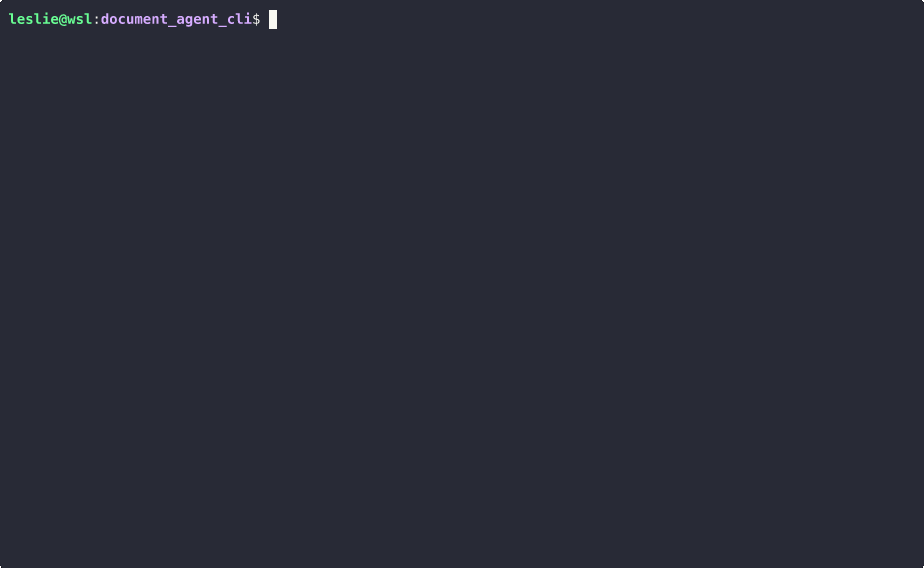

# Document Agent CLI

> **DISCLAIMER**: This is an alpha version. Not all features have been completely tested, so there may be issues. If you encounter any problems, please report them by creating an issue in the repository.

A powerful command-line interface for document management and AI-powered question answering using a LLM Document Processing API. This project provides two command-line interfaces for interacting with document processing and AI question answering functionality.

## Table of Contents

- [Requirements](#requirements)
- [Setup](#setup)
  - [Environment Setup](#environment-setup)
  - [Project Installation](#project-installation)
- [Admin CLI](#admin-cli)
  - [Description](#description)
  - [Features](#features)
  - [Example Usage](#example-usage)
- [Agent CLI](#agent-cli)
  - [Description](#description-1)
  - [Features](#features-1)
  - [Example Usage](#example-usage-1)
  - [Upload Documents](#upload-documents)
  - [Ask Questions About Documents](#ask-questions-about-documents)
- [Available Commands](#available-commands)
  - [Document Management](#document-management)
  - [Document Analysis](#document-analysis)
  - [Asking Questions](#asking-questions)
  - [Session Management](#session-management)
  - [Filters](#filters)
- [License](#license)

## Requirements

- Python 3.10+
- PDM (Python dependency manager)
- Connection for Agent API communication
- Linux/macOS (for shell script execution)

## Setup

### Environment Setup

```bash
# Clone the repository
git clone git@github.com:Flomayliz/document_agent_cli.git
cd document_agent_cli

# Make the environment setup script executable
chmod +x ./scripts/setup_cli_env.sh

# Run the environment setup script
./scripts/setup_cli_env.sh
```

### Project Installation

```bash
# Install project dependencies using PDM
pdm install
```

## Admin CLI

### Description

The Admin CLI is designed for administrators to manage users, authentication tokens, and monitor user interactions with the system. It provides both command-line and interactive modes for performing administrative tasks.

### Features

- **User Management**: Create, retrieve, and delete users
- **Token Management**: Generate and refresh authentication tokens for API access
- **User History**: View Q&A history for specific users
- **Validation**: Validate existing authentication tokens
- **Interactive Mode**: Command-line interface with multiple operation options

### Example Usage

```bash
# Run the admin CLI
pdm run admin_cli
```

From the interactive prompt, you can:
- Create a new user: `create_user:<username>`
- Generate a token: `generate_token:<user_id>`
- View user history: `get_history:<user_id>`
- Validate a token: `validate_token:<token>`



Make sure to save the generated key so the User CLI can use it.

## Agent CLI

### Description

The Agent CLI (User CLI) is designed for end users to interact with documents and AI functionality. It allows users to manage documents, ask questions, and analyze document content using natural language.

### Features

- **Document Management**: Upload, list, and delete documents
- **Document Analysis**: Generate summaries and extract topics from documents
- **AI Question Answering**: Ask questions about documents or general knowledge
- **Interactive Mode**: Fully interactive command-line interface with helpful commands
- **Session Management**: Maintain conversation history within a session
- **Authentication**: Secure API access using tokens generated by the Admin CLI
- **Document-specific Queries**: Ask questions about specific documents using document IDs

### Example Usage

First, set up your authentication:

```bash
# Set your authentication token
export APP_API_TOKEN=<your-key>

# Launch the user CLI
pdm run user_cli
```


#### Upload Documents

```
upload:/path/to/your/document.pdf
```


#### Ask Questions About Documents

You can ask questions about your documents, and the AI will provide answers based on the document content. The example below demonstrates how to:

- List documents available
- Filter documents 
- Summary content
- Compare different files
- List topics
- Answer open questions


## Available Commands

> **Note**: All the features listed above can also be accessed directly through the QA interface. Users can achieve the same results by properly formulating natural language questions. For example, instead of using the `summary:123` command, you could ask "Can you provide a summary of document 123?" The AI will interpret your intent and provide the appropriate response.

The Agent CLI supports the following commands:

### Document Management
- `list_docs`: List all uploaded documents
- `upload:/path/to/file`: Upload a new document
- `delete_doc:<document_id>`: Delete a specific document

### Document Analysis
- `summary:<document_id>`: Generate a summary of a document
- `topics:<document_id>`: Extract main topics from a document
- `compare:<doc_id_1>,<doc_id_2>`: Compare two documents

### Asking Questions
- `<your question>`: Ask a general question
- `ask:<document_id>:<your question>`: Ask about a specific document
- `ask:<doc_id_1>,<doc_id_2>:<your question>`: Ask about multiple documents

### Session Management
- `new_session`: Start a new conversation session
- `exit` or `quit`: Exit the CLI
- `help`: Display help information

### Filters
- `filter:topic:<topic>`: Filter documents by topic
- `filter:date:<date_range>`: Filter documents by date
- `filter:type:<file_type>`: Filter documents by file type

## License

This project is licensed under the MIT License - see the [LICENSE](LICENSE) file for details.
